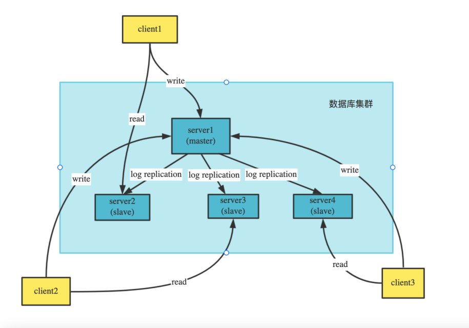
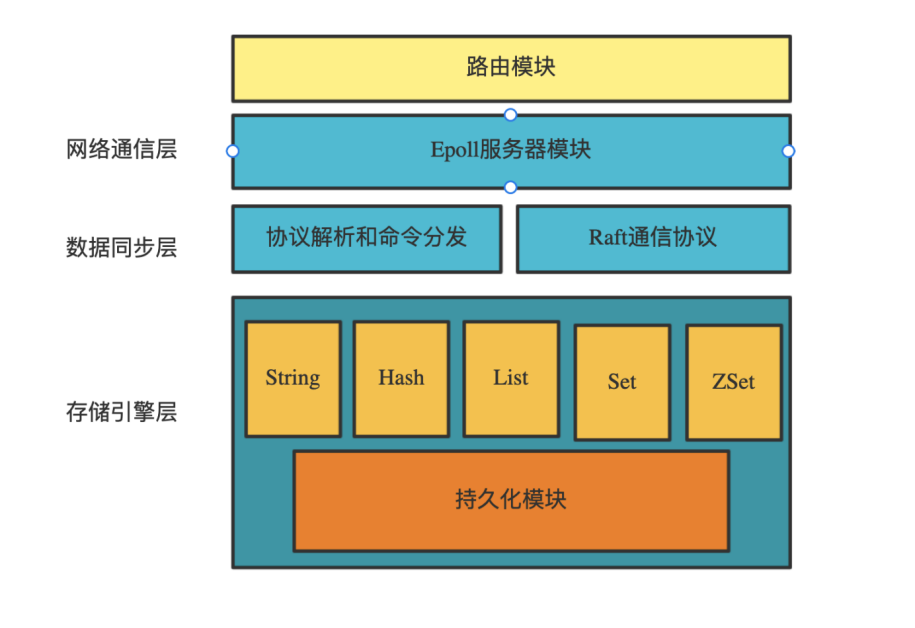

# lightdb


## 介绍
是一款基于BitCask模型的分布式键值对数据库，支持类似redis的数据类型和交互命令，实现了基于Raft算法的冗余复制集群能力。

### 网络结构

上图展示了一个Lightdb的集群的结构图，Leader节点可以服务读写请求，Follower节点可以服务读请求

### 总体架构



### 服务器架构

上图展示了lightdb的服务器架构，通过安全安全队列

## 快速开始

### 编译 
clone之后，执行./build.sh

### 配置文件

#### 存储引擎配置文件
配置文件的后缀名为.conf，下面为一个配置文件的示例

```conf

#this is a config file
#端口号
Port  5204
#目录
DirPath  /tmp/test/lightdb4
#文件访问方式，可以是FileIO 或者 MMap
FileRWMethod  FileIO
#索引模式，可以为KeyOnlyMemMode（String类型，只有Key存在内存中）
#或者KeyValueMemMode（表示String类型key和Value均存在内存中）
IndexMode  KeyOnlyMemMode
#单数据文件最大长度
BlockSize  1048576
#Key最大长度
MaxKeySize  1024
#Value最大长度
MaxValueSize  1048576
#是否同步写盘
Sync  False
#日志文件合并阈值
MergeThreshold  64
#日志文件合并检查周期
MergeCheckInterval  3600000
#缓存最大容量
CacheCapacity  1024

```

#### 集群配置文件
Lightdb是一个分布式键值对数据库，启动的时候需要指定集群配置文件，集群配置文件为json格式，后缀名为.json。下面展示一个典型的集群配置文件。
```json
{
  "servers":[
    {
      "num": 0,
      "host":"127.0.0.1",
      "port": 5200
    },
    {
      "num": 1,
      "host":"127.0.0.1",
      "port": 5201
    },
    {
      "num": 2,
      "host":"127.0.0.1",
      "port": 5202
    }
  ],
  "me":0
}
```
该集群配置文件表明，这是一个三个节点组成的集群，本节点在集群中的角色是0号节点。


### 运行服务器
运行一个服务器需要两个参数，第一个为存储引擎配置文件路径，第二个为集群配置文件路径。

举例：编译成功后，执行下面的命令启动一个单节点的集群，
```sh
./LightDBServer *.conf *.json 
```
这里的参数为配置文件路径，可以根据自己的喜好自由配置

#### Client
同样在build文件夹中，运行

```sh
./Client 127.0.0.1 5200 # 第一个参数为连接的server的IP， 第二个参数为端口号
```


### 基准测试

下面是压力测试实际表现，测试数据量均为100w。测试是将存储引擎离线执行，并没有通过客户端服务器调用

#### String

测试代码：

|  command   | qps  | 数据量 
|  ----  | ----  | ---- 
| strset  | 140984 | 100w
| strget  | 104220 | 100w
#### List

keys表示测试中list的个数， values_per_list 表示平均每个list的大小，当参与测试的list较大时， 大量的时间开销在于内存中list的维护，下面列出当两个参数变化时候的qps

|  command   | qps  | 数据量  | keys  | values_per_list|
|  ----  | ----  | ---- |----| ---- |
| listLPush  | 167616 | 100w |10000 | 100|
| listLPush  | 149611 | 100w |5000 | 200|
| listLPush  | 136742 | 100w |2500 | 400|
| listLPush  | 79472 | 100w |1000 | 1000|


#### Set
说明：参数keys表示测试中key的数量，参数values_per_set表示每个key的大小
测试结果
|  command   | qps  | 数据量  | keys  | values_per_set|
|  ----  | ----  | ---- |----| ---- |
| SAdd  | 502260 | 100w |10000 | 100|
| SAdd  | 491883 | 100w |5000 | 200|
| SAdd  | 456621 | 100w |2500 | 400|
| SAdd  | 490677 | 100w |1000 | 1000|
| SAdd  | 502260 | 100w |500 | 2000|

#### ZSet
测试结果
|  command   | qps  | 数据量  | keys  | values_per_zset|
|  ----  | ----  | ---- |----| ---- |
| ZAdd  | 283687 | 100w |10000 | 100|
| ZAdd  | 160102 | 100w |5000 | 200|
| ZAdd  | 95210 | 100w |2500 | 400|
| ZAdd  | 711743 | 100w |1000 | 1000|
| ZAdd  | 87519 | 100w |500 | 2000|

#### ZScore
|  command   | qps  | 数据量  | keys  | values_per_zset|
|  ----  | ----  | ---- |----| ---- |
| ZScore  | 586510 | 100w |1000 | 1000|


